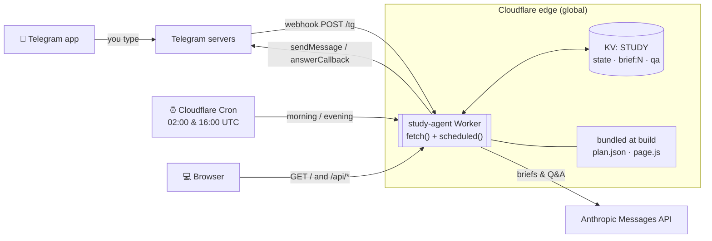
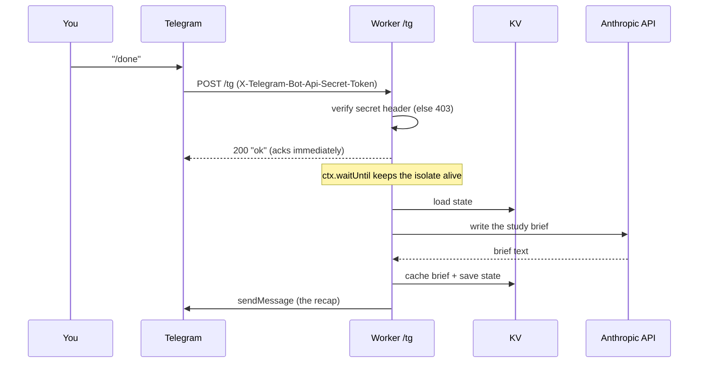

# study-agent

A personal Telegram study coach that serves a 48-week Data / AI / DevOps
mastery roadmap **one day at a time**, auto-shifts when days slip, writes a
deep study brief after each finished day, answers free-form questions, and
shows the whole year on a private dashboard.

It runs **24/7 on Cloudflare — with no server and no always-on machine.** The
entire thing is one Cloudflare Worker: a Telegram webhook, two cron sends a
day, and a gated dashboard, all backed by a key-value store.

- **Bot:** `@jayanth_study_bot` (Telegram)
- **Dashboard:** `https://study-agent.jayanthapalla.workers.dev` _(private — passphrase-gated)_
- **Runtime:** Cloudflare Workers · KV · Cron Triggers — free tier
- **Model:** briefs & Q&A via the Anthropic Messages API

---

## Progress

<!-- PROGRESS:START -->
`░░░░░░░░░░░░░░░░░░░░░░░░`

**0/336** days done · **0.0%**

<sub>▓ done · ▒ in progress (½ credit) · ░ to go</sub>

- **Current:** Week 1/48
- **Streak:** 0 days
- **Pending builds:** 48
- **Last completed:** —
- **Updated:** seeded 2026-07-24 · auto-updates after each completed day

<details><summary>48-week board (✅ done · 🟨 partial · ⬜ pending · Mon→Sun)</summary>

`W01` ⬜⬜⬜⬜⬜⬜⬜
`W02` ⬜⬜⬜⬜⬜⬜⬜
`W03` ⬜⬜⬜⬜⬜⬜⬜
`W04` ⬜⬜⬜⬜⬜⬜⬜
`W05` ⬜⬜⬜⬜⬜⬜⬜
`W06` ⬜⬜⬜⬜⬜⬜⬜
`W07` ⬜⬜⬜⬜⬜⬜⬜
`W08` ⬜⬜⬜⬜⬜⬜⬜
`W09` ⬜⬜⬜⬜⬜⬜⬜
`W10` ⬜⬜⬜⬜⬜⬜⬜
`W11` ⬜⬜⬜⬜⬜⬜⬜
`W12` ⬜⬜⬜⬜⬜⬜⬜
`W13` ⬜⬜⬜⬜⬜⬜⬜
`W14` ⬜⬜⬜⬜⬜⬜⬜
`W15` ⬜⬜⬜⬜⬜⬜⬜
`W16` ⬜⬜⬜⬜⬜⬜⬜
`W17` ⬜⬜⬜⬜⬜⬜⬜
`W18` ⬜⬜⬜⬜⬜⬜⬜
`W19` ⬜⬜⬜⬜⬜⬜⬜
`W20` ⬜⬜⬜⬜⬜⬜⬜
`W21` ⬜⬜⬜⬜⬜⬜⬜
`W22` ⬜⬜⬜⬜⬜⬜⬜
`W23` ⬜⬜⬜⬜⬜⬜⬜
`W24` ⬜⬜⬜⬜⬜⬜⬜
`W25` ⬜⬜⬜⬜⬜⬜⬜
`W26` ⬜⬜⬜⬜⬜⬜⬜
`W27` ⬜⬜⬜⬜⬜⬜⬜
`W28` ⬜⬜⬜⬜⬜⬜⬜
`W29` ⬜⬜⬜⬜⬜⬜⬜
`W30` ⬜⬜⬜⬜⬜⬜⬜
`W31` ⬜⬜⬜⬜⬜⬜⬜
`W32` ⬜⬜⬜⬜⬜⬜⬜
`W33` ⬜⬜⬜⬜⬜⬜⬜
`W34` ⬜⬜⬜⬜⬜⬜⬜
`W35` ⬜⬜⬜⬜⬜⬜⬜
`W36` ⬜⬜⬜⬜⬜⬜⬜
`W37` ⬜⬜⬜⬜⬜⬜⬜
`W38` ⬜⬜⬜⬜⬜⬜⬜
`W39` ⬜⬜⬜⬜⬜⬜⬜
`W40` ⬜⬜⬜⬜⬜⬜⬜
`W41` ⬜⬜⬜⬜⬜⬜⬜
`W42` ⬜⬜⬜⬜⬜⬜⬜
`W43` ⬜⬜⬜⬜⬜⬜⬜
`W44` ⬜⬜⬜⬜⬜⬜⬜
`W45` ⬜⬜⬜⬜⬜⬜⬜
`W46` ⬜⬜⬜⬜⬜⬜⬜
`W47` ⬜⬜⬜⬜⬜⬜⬜
`W48` ⬜⬜⬜⬜⬜⬜⬜

</details>
<!-- PROGRESS:END -->

_The board above is rewritten automatically after each completed day (via the GitHub API from the Worker)._

---

## Contents

- [Progress](#progress)
- [What it does](#what-it-does)
- [Architecture](#architecture)
- [How it runs 24/7 with no server](#how-it-runs-247-with-no-server)
- [The three event flows](#the-three-event-flows)
- [Data model](#data-model)
- [The schedule logic (day-of-week + pointer)](#the-schedule-logic-day-of-week--pointer)
- [Telegram commands](#telegram-commands)
- [The dashboard](#the-dashboard)
- [Repository layout](#repository-layout)
- [Deploy from scratch](#deploy-from-scratch)
- [Operations](#operations)
- [Security model](#security-model)
- [Cost](#cost)
- [Rollback to the local bot](#rollback-to-the-local-bot)

---

## What it does

- **07:30 IST** — sends today's assignment (the next pending unit for the day).
- **21:30 IST** — evening check with ✅ Done / 🔸 Partial / ⏭ Skip buttons.
- **On Done** — writes a ~20–30 minute study brief on the day's topic with the
  model, sends it to Telegram (chunked), and caches it so re-reading never
  re-bills the API.
- **Any question** — send plain text and it answers, grounded in where you are
  in the plan, with short follow-up memory.
- **Dashboard** — a private page showing progress, a year-at-a-glance heatmap,
  per-type balance, the "up next" topic, every brief, and an ask box.

---

## Architecture

One Worker on Cloudflare's edge. Nothing runs between events; each trigger
spins up the Worker for a few milliseconds and then it's gone.



**Key idea:** the *plan* is code (bundled from `plan.json`, changes only on
redeploy) and your *progress* is data (lives in KV, changes as you study). They
never touch each other — redeploying never affects progress, and studying never
affects the plan.

---

## How it runs 24/7 with no server

A Worker is **not** a machine you rent and keep alive. It's a code bundle
uploaded to every Cloudflare edge location plus some data in KV. Between events,
**zero compute runs** — there's nothing to crash, patch, or keep up.

When an event arrives (a message, a cron tick, a browser request), Cloudflare
spins a lightweight V8 isolate (~5 ms cold start) on the nearest edge, runs the
handler, and tears it down. Availability is Cloudflare's edge itself, which is
effectively always-on worldwide.

This replaced the previous design — a Python process on a laptop running a
`getUpdates` polling loop under `systemd`, which could only be as available as
the laptop. See [Rollback to the local bot](#rollback-to-the-local-bot); that
code still lives in [`study_agent.py`](study_agent.py) as a fallback.

---

## The three event flows

### 1. Telegram message → `fetch` → `/tg`



The Worker **acks in milliseconds**, then finishes the slow work (the model call
can take 10–30 s) in the background via `ctx.waitUntil()`. That matters because
Telegram retries a webhook that doesn't answer quickly.

### 2. The clock → `scheduled` (cron)

Cloudflare's cron scheduler fires `scheduled()` at fixed UTC times; the handler
branches on `event.cron`:

| Cron (UTC) | IST | Action |
|---|---|---|
| `0 2 * * *` | 07:30 | morning assignment |
| `0 16 * * *` | 21:30 | evening check (skippable) |

It reads KV state (does nothing if paused), computes the day-appropriate unit,
and sends it. This is what replaced the laptop's forever-loop.

### 3. Browser → `fetch` → dashboard

```
GET  /            → the HTML page (strict CSP); contains NO progress data
   unlock w/ passphrase ─► JS sends header  X-Study-Key: <passphrase>
GET  /api/state   → verifies the key → reads KV → computes → JSON → renders
GET  /api/brief/N → a cached brief (or generates one, then caches it)
POST /api/ask     → a study question, answered in context
```

---

## Data model

| Layer | Contents | Mutable? | Where it lives |
|---|---|---|---|
| **Bundled at build** | 336-unit `plan.json`, dashboard `page.js` | No — versioned with code | inside the Worker bundle |
| **KV namespace `STUDY`** | `state` (progress), `brief:<id>` (cached recaps), `qa` (rolling Q&A memory) | Yes — read/write per event | Cloudflare KV (global) |
| **Secrets / vars** | bot token, API key, webhook secret, dashboard passphrase; model name, token cap | Set once | encrypted in Cloudflare, injected as `env.*` |

`state` shape:

```json
{ "done": { "12": { "date": "2026-07-24", "status": "done" } },
  "partials": { "13": "2026-07-24" },
  "paused": false, "skipped_today": null, "last_done": 12 }
```

---

## The schedule logic (day-of-week + pointer)

The plan is 336 ordered units (43 content weeks + 5 catch-up / deep-dive weeks),
served by **day of week**, never by calendar date. A pointer walks the queue;
finishing a day advances it, missing a day doesn't.

- **Weekdays → theory.** Builds and consolidations never appear on a weekday.
- **Saturday → the week's build** — unless weekday theory was missed, in which
  case the missed topic is served first and the build slides to Sunday.
- **Sunday → consolidation** — or any still-unfinished theory/build first.

Miss a day and nothing is lost: the backlog **cascades forward** into the next
available slots (a missed Friday overflows into Saturday, Saturday into Sunday).
Builds stay weekend work; only theory overflows into the weekend. **Partial** →
the leftover carries over. `/status` shows how many earlier topics you still owe.

---

## Telegram commands

| Command | Does |
|---|---|
| `/today` | Show today's assignment |
| `/done` | Mark done + get the study brief |
| `/partial` | Did part of it — carries over |
| `/skip` | Skip today (no evening nag) |
| `/summary` | Re-send the last study brief |
| `/status` | Progress + any catch-up backlog |
| `/pause` · `/resume` | Silence / restore daily messages |
| `/help` | Show the command list |

Any **non-command message** is treated as a question and answered in context.

---

## The dashboard

A private, passphrase-gated single page (aurora theme, rendered entirely
client-side from `/api/state`):

- Hero **% complete**, **streak**, current week, builds left.
- A weighted **progress bar** (in-progress days get half credit).
- **Up next** — the current topic in full.
- **Balance** — per-type meters (theory / build / consolidate).
- **The year** — a 7×48 heatmap of every day, colored by topic type; click a
  finished cell to reread its brief.
- **Briefs** — every completed day, its recap rendered from Markdown.
- **Ask** — a study question answered in context.

The HTML shell is public but data-free; all progress is fetched only after the
passphrase check (wrong key → 401 with a deliberate delay).

---

## Repository layout

```
study-agent/
├── plan.json               # the 336-unit roadmap (source of truth for content)
├── generate_daily_plan.py  # builds plan.json from the roadmap
├── daily-plan.md           # human-readable roadmap
├── cloud/                  # ← the live deployment
│   ├── worker.js           #   the whole backend: webhook + cron + dashboard API
│   ├── page.js             #   the dashboard HTML/CSS/JS (one string)
│   ├── wrangler.jsonc      #   Worker manifest: KV binding, cron triggers, vars
│   └── DEPLOY_SECRETS.local.txt   # passphrase/URL note (gitignored)
├── study_agent.py          # the retired local (systemd) bot — kept as fallback
└── study-agent.service     # its systemd unit (now disabled)
```

---

## Deploy from scratch

From `cloud/` with `wrangler` authenticated (`npx wrangler login`):

```bash
# 1. create the KV namespace, put the printed id into wrangler.jsonc
npx wrangler kv namespace create STUDY

# 2. set the secrets (values not echoed)
printf '%s' "<bot-token>"      | npx wrangler secret put STUDY_BOT_TOKEN
printf '%s' "<numeric-chatid>" | npx wrangler secret put STUDY_CHAT_ID
printf '%s' "<anthropic-key>"  | npx wrangler secret put ANTHROPIC_API_KEY
printf '%s' "$(openssl rand -hex 24)"    | npx wrangler secret put TG_SECRET
printf '%s' "$(openssl rand -base64 12)" | npx wrangler secret put STUDY_UI_KEY

# 3. seed the initial state
npx wrangler kv key put state \
  '{"done":{},"partials":{},"paused":false,"skipped_today":null,"last_done":null}' \
  --namespace-id <KV_ID> --remote

# 4. deploy (bundles ../plan.json + page.js, registers the crons)
npx wrangler deploy

# 5. point Telegram's webhook at the Worker (TG_SECRET must match the secret above)
curl -X POST "https://api.telegram.org/bot<token>/setWebhook" \
  -H 'content-type: application/json' \
  -d '{"url":"https://study-agent.jayanthapalla.workers.dev/tg",
       "secret_token":"<TG_SECRET>",
       "allowed_updates":["message","callback_query"]}'
```

Optional: set `GH_PAT` + `VAULT_REPO` secrets to also mirror each brief into an
Obsidian vault git repo via the GitHub API.

---

## Operations

```bash
# redeploy after a code change
cd cloud && npx wrangler deploy

# rotate / change a secret
printf '%s' 'NEW_VALUE' | npx wrangler secret put STUDY_UI_KEY

# inspect or edit live state
npx wrangler kv key get state --namespace-id <KV_ID> --remote
npx wrangler kv key put state '<json>' --namespace-id <KV_ID> --remote

# live logs (webhook hits, cron runs, errors)
npx wrangler tail

# check the webhook registration
curl "https://api.telegram.org/bot<token>/getWebhookInfo"
```

---

## Security model

- **Webhook** — rejects any request without the exact `TG_SECRET` header (403);
  the handler additionally ignores any chat that isn't `STUDY_CHAT_ID`.
- **Dashboard data** — every `/api/*` route requires the `STUDY_UI_KEY`
  passphrase; a wrong key returns 401 after a deliberate ~800 ms delay.
- **The page** — a strict Content-Security-Policy (`default-src 'none'`,
  `connect-src 'self'`) blocks all external and cross-origin requests.
- **Secrets** — never in the repo or the bundle; stored encrypted in Cloudflare
  and injected at runtime.

---

## Cost

The Workers free tier (100k requests/day) and KV free tier comfortably cover a
personal bot; cron and the isolate runtime are free at this volume. The only
metered dependency is the model API (billed per token); Telegram is free.

---

## Rollback to the local bot

The old laptop bot is stopped and disabled but intact. To switch back:

```bash
curl "https://api.telegram.org/bot<token>/deleteWebhook"   # free the polling API
systemctl --user enable --now study-agent                  # restart the local bot
```

A bot can't poll and use a webhook at once, so deleting the webhook is what lets
`getUpdates` work again.
