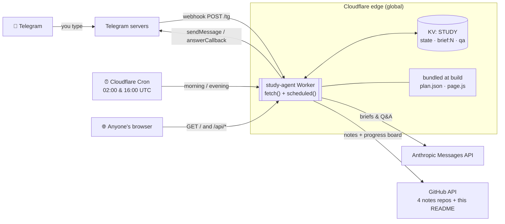
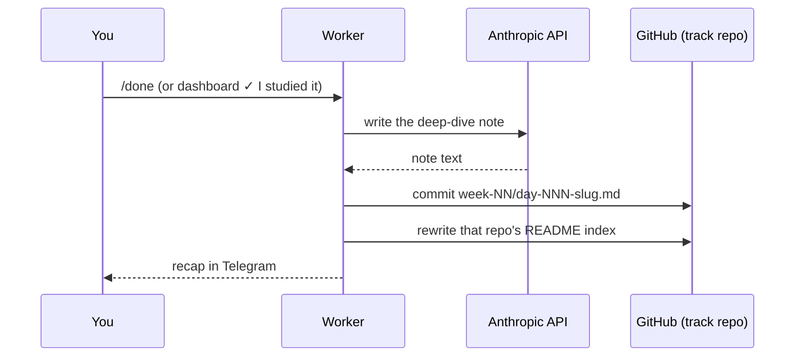

# study-agent

A personal study coach that turns a **62-week, 434-day mastery roadmap** —
Data Engineering → Data Science & ML → Deep Learning & AI → Linux & Systems —
into **one topic a day**, delivered over Telegram, tracked on a **public
dashboard**, and written up as a **deep-dive note pushed to GitHub** every day
I finish.

It runs **24/7 on Cloudflare — no server, no always-on machine.** The whole
thing is a single Worker: a Telegram webhook, two daily cron sends, a public
dashboard, and per-track note commits, all backed by a key-value store.

| | |
|---|---|
| 🤖 **Bot** | `@jayanth_study_bot` on Telegram |
| 📊 **Dashboard** | **[study-agent.jayanthapalla.workers.dev](https://study-agent.jayanthapalla.workers.dev)** — public & live |
| ⚙️ **Runtime** | Cloudflare Workers · KV · Cron Triggers (free tier) |
| 🧠 **Model** | study briefs & Q&A via the Anthropic Messages API |

---

## The four tracks

The roadmap runs as four ordered tracks. **Every day I finish generates a
written deep-dive note, auto-committed to that track's own public repo** — a
growing learning-in-public trail. Each notes repo links back here and to the
dashboard, and cross-links its siblings.

| Track | Weeks | Focus | 📓 Notes |
|---|---|---|---|
| **Data Engineering** | 1–18 | Python, storage internals, SQL & dimensional modeling, dbt, Spark/PySpark, Databricks lakehouse, Kafka streaming, orchestration | **[de-notes](https://github.com/astroboy1183/de-notes)** |
| **Data Science & ML** | 19–33 | stats & A/B testing, ML from scratch, gradient boosting, feature stores, evaluation, forecasting, recommenders, MLflow, deployment | **[ml-notes](https://github.com/astroboy1183/ml-notes)** |
| **Deep Learning & AI** | 34–48 | neural nets → PyTorch, CNNs, transformers from scratch, training GPTs, LLM apps, RAG, LoRA fine-tuning, agents & MCP | **[ai-notes](https://github.com/astroboy1183/ai-notes)** |
| **Linux & Systems** | 49–62 | shell & automation, server hardening, systems programming, a container runtime from scratch, Kubernetes, IaC/GitOps, observability | **[linux-notes](https://github.com/astroboy1183/linux-notes)** |

Each week is **5 theory days (weekdays) + 1 build (Saturday) + 1 consolidation
(Sunday)** — 62 flagship builds in all, from a mini LSM-tree engine to a
production RAG app to a container runtime.

---

## Progress

<!-- PROGRESS:START -->
`░░░░░░░░░░░░░░░░░░░░░░░░`

**0/434** days done · **0.0%**

<sub>▓ done · ▒ in progress (½ credit) · ░ to go</sub>

- **Current:** Week 1/62
- **Streak:** 0 days
- **Pending builds:** 62
- **Last completed:** —
- **Updated:** seeded 2026-07-25 · auto-updates after each completed day

<details><summary>62-week board (✅ done · 🟨 partial · ⬜ pending · Mon→Sun)</summary>

`W01` ⬜⬜⬜⬜⬜⬜⬜
`W02` ⬜⬜⬜⬜⬜⬜⬜
`W03` ⬜⬜⬜⬜⬜⬜⬜
`W04` ⬜⬜⬜⬜⬜⬜⬜
`W05` ⬜⬜⬜⬜⬜⬜⬜
`W06` ⬜⬜⬜⬜⬜⬜⬜
`W07` ⬜⬜⬜⬜⬜⬜⬜
`W08` ⬜⬜⬜⬜⬜⬜⬜
`W09` ⬜⬜⬜⬜⬜⬜⬜
`W10` ⬜⬜⬜⬜⬜⬜⬜
`W11` ⬜⬜⬜⬜⬜⬜⬜
`W12` ⬜⬜⬜⬜⬜⬜⬜
`W13` ⬜⬜⬜⬜⬜⬜⬜
`W14` ⬜⬜⬜⬜⬜⬜⬜
`W15` ⬜⬜⬜⬜⬜⬜⬜
`W16` ⬜⬜⬜⬜⬜⬜⬜
`W17` ⬜⬜⬜⬜⬜⬜⬜
`W18` ⬜⬜⬜⬜⬜⬜⬜
`W19` ⬜⬜⬜⬜⬜⬜⬜
`W20` ⬜⬜⬜⬜⬜⬜⬜
`W21` ⬜⬜⬜⬜⬜⬜⬜
`W22` ⬜⬜⬜⬜⬜⬜⬜
`W23` ⬜⬜⬜⬜⬜⬜⬜
`W24` ⬜⬜⬜⬜⬜⬜⬜
`W25` ⬜⬜⬜⬜⬜⬜⬜
`W26` ⬜⬜⬜⬜⬜⬜⬜
`W27` ⬜⬜⬜⬜⬜⬜⬜
`W28` ⬜⬜⬜⬜⬜⬜⬜
`W29` ⬜⬜⬜⬜⬜⬜⬜
`W30` ⬜⬜⬜⬜⬜⬜⬜
`W31` ⬜⬜⬜⬜⬜⬜⬜
`W32` ⬜⬜⬜⬜⬜⬜⬜
`W33` ⬜⬜⬜⬜⬜⬜⬜
`W34` ⬜⬜⬜⬜⬜⬜⬜
`W35` ⬜⬜⬜⬜⬜⬜⬜
`W36` ⬜⬜⬜⬜⬜⬜⬜
`W37` ⬜⬜⬜⬜⬜⬜⬜
`W38` ⬜⬜⬜⬜⬜⬜⬜
`W39` ⬜⬜⬜⬜⬜⬜⬜
`W40` ⬜⬜⬜⬜⬜⬜⬜
`W41` ⬜⬜⬜⬜⬜⬜⬜
`W42` ⬜⬜⬜⬜⬜⬜⬜
`W43` ⬜⬜⬜⬜⬜⬜⬜
`W44` ⬜⬜⬜⬜⬜⬜⬜
`W45` ⬜⬜⬜⬜⬜⬜⬜
`W46` ⬜⬜⬜⬜⬜⬜⬜
`W47` ⬜⬜⬜⬜⬜⬜⬜
`W48` ⬜⬜⬜⬜⬜⬜⬜
`W49` ⬜⬜⬜⬜⬜⬜⬜
`W50` ⬜⬜⬜⬜⬜⬜⬜
`W51` ⬜⬜⬜⬜⬜⬜⬜
`W52` ⬜⬜⬜⬜⬜⬜⬜
`W53` ⬜⬜⬜⬜⬜⬜⬜
`W54` ⬜⬜⬜⬜⬜⬜⬜
`W55` ⬜⬜⬜⬜⬜⬜⬜
`W56` ⬜⬜⬜⬜⬜⬜⬜
`W57` ⬜⬜⬜⬜⬜⬜⬜
`W58` ⬜⬜⬜⬜⬜⬜⬜
`W59` ⬜⬜⬜⬜⬜⬜⬜
`W60` ⬜⬜⬜⬜⬜⬜⬜
`W61` ⬜⬜⬜⬜⬜⬜⬜
`W62` ⬜⬜⬜⬜⬜⬜⬜

</details>
<!-- PROGRESS:END -->

_The board and notes repos are rewritten automatically from the Worker (via the
GitHub API) after each completed day._

---

## What it does

- **07:30 IST** — sends today's assignment (the next pending unit for the day).
- **21:30 IST** — an evening check with ✅ Done / 🔸 Partial / ⏭ Skip buttons.
- **On Done** — writes a ~20–30 min study brief with the model, sends it to
  Telegram, **commits a rich deep-dive note to the track's GitHub repo**, and
  caches it so re-reading never re-bills the API.
- **Check in from anywhere** — mark a day done from Telegram (`/done`) **or**
  the dashboard's owner-only **✓ I studied it** button; both trigger the note.
- **Ask anything** — send plain text and it answers, grounded in where you are
  in the plan, with short follow-up memory.
- **Public dashboard** — anyone can watch progress, browse the full roadmap,
  and read every finished-day brief.

---

## Architecture

One Worker on Cloudflare's edge. Nothing runs between events; each trigger
spins up the Worker for a few milliseconds, then it's gone.


```mermaid
flowchart LR
  phone["📱 Telegram"] -->|you type| TG["Telegram servers"]
  Cron["⏰ Cloudflare Cron<br/>02:00 &amp; 16:00 UTC"]
  Browser["🌐 Anyone's browser"]

  subgraph Edge["Cloudflare edge (global)"]
    W[["study-agent Worker<br/>fetch() + scheduled()"]]
    KV[("KV: STUDY<br/>state · brief:N · qa")]
    Bundle["bundled at build<br/>plan.json · page.js"]
    W <--> KV
    W --- Bundle
  end

  TG -->|"webhook POST /tg"| W
  Cron -->|"morning / evening"| W
  Browser -->|"GET / and /api/*"| W

  W -->|"briefs &amp; Q&amp;A"| ANT["Anthropic Messages API"]
  W -->|"notes + progress board"| GH["GitHub API<br/>4 notes repos + this README"]
  W -->|"sendMessage / answerCallback"| TG
```

**Key idea:** the *plan* is code (bundled from `plan.json`, changes only on
redeploy) and your *progress* is data (lives in KV, changes as you study). They
never touch — redeploying never affects progress, and studying never affects
the plan.

**How it stays up 24/7 with no server:** a Worker isn't a machine you rent and
keep alive — it's a code bundle on every Cloudflare edge plus data in KV.
Between events, **zero compute runs**: nothing to crash, patch, or keep up.
When an event arrives, Cloudflare spins a V8 isolate (~5 ms) on the nearest
edge, runs the handler, and tears it down. This replaced an earlier design — a
Python `getUpdates` loop under `systemd` on a laptop, only as available as the
laptop. That code still lives in [`study_agent.py`](study_agent.py) as a
fallback.

---

## Daily notes → GitHub

Finishing a day is the single trigger for everything downstream:


```mermaid
sequenceDiagram
  participant You
  participant W as Worker
  participant M as Anthropic API
  participant GH as GitHub (track repo)
  You->>W: /done  (or dashboard ✓ I studied it)
  W->>M: write the deep-dive note
  M-->>W: note text
  W->>GH: commit week-NN/day-NNN-slug.md
  W->>GH: rewrite that repo's README index
  W-->>You: recap in Telegram
```

Each note is routed to the right repo by week (`1–18 → de-notes`, `19–33 →
ml-notes`, `34–48 → ai-notes`, `49–62 → linux-notes`) and carries the topic,
the day's work, a mastery check, and a model-written deep dive. All GitHub
commits are made with a personal access token and are authored under my own
account.

---

## The schedule (day-of-week + pointer)

The plan is 434 ordered units served by **day of week**, never by calendar
date. A pointer walks the queue; finishing a day advances it, missing one
doesn't.

- **Weekdays → theory.** Builds and consolidations never appear on a weekday.
- **Saturday → the week's build** — unless weekday theory was missed, in which
  case the missed topic comes first and the build slides to Sunday.
- **Sunday → consolidation** — or any still-unfinished theory/build first.
- **Build-gating:** a week's build unlocks only once that week's theory is done.

Miss a day and nothing is lost — the backlog **cascades forward** into the next
available slots. **Partial** carries the leftover over; `/status` shows how many
earlier topics you still owe; `/catchup` serves them oldest-first.

---

## Telegram commands

| Command | Does |
|---|---|
| `/today` | Show today's assignment |
| `/done` | Mark done → study brief → note pushed to GitHub |
| `/partial` | Did part of it — the leftover carries over |
| `/skip` | Skip today |
| `/more` | Serve the next unit — get ahead |
| `/catchup` | Start the oldest topic you owe |
| `/summary` | Re-send the last study brief |
| `/status` | Progress + any catch-up backlog |
| `/off` | Log an honest day off (keeps the streak honest) |
| `/pause` · `/resume` | Silence / restore the daily messages |
| `/help` | Show the command list |

Any **non-command message** is treated as a question and answered in context.

---

## The dashboard

A **public** single page (aurora theme, rendered client-side from
`/api/state`) — built for anyone visiting to see the work at a glance:

- Hero **% complete**, **honest streak**, current week, domains, builds.
- A **62-week board** heatmap of every day, colored by type; click a finished
  cell to reread its brief.
- The full **roadmap browser**, **projects** (the 62 builds, with owner-attached
  repo/demo links), and a **presence heatmap**.
- An **owner edit mode** (passphrase-gated): attach project links and hit
  **✓ I studied it** to check in. Everything else is read-only for visitors.

Reads are public; **writes** (`/api/checkin`, `/api/project`, `/api/auth`)
require the `STUDY_UI_KEY` passphrase — a wrong key returns 401 after a
deliberate delay.

---

## Repository layout

```
study-agent/
├── plan.json               # the 434-unit roadmap (source of truth for content)
├── generate_plan_v2.py     # regenerates plan.json (62 weeks, 4 tracks)
├── daily-plan.md           # human-readable roadmap
├── cloud/                  # ← the live deployment
│   ├── worker.js           #   backend: webhook + cron + dashboard API + notes push
│   ├── page.js             #   the dashboard (one HTML/CSS/JS string)
│   └── wrangler.jsonc      #   Worker manifest: KV binding, crons, vars
├── study_agent.py          # the retired local (systemd) bot — kept as fallback
└── study-agent.service     # its systemd unit (now disabled)
```

---

## Deploy from scratch

From `cloud/` with `wrangler` authenticated (`npx wrangler login`):

```bash
# 1. create the KV namespace; put the printed id into wrangler.jsonc
npx wrangler kv namespace create STUDY

# 2. set the secrets (values never echoed)
printf '%s' "<bot-token>"              | npx wrangler secret put STUDY_BOT_TOKEN
printf '%s' "<numeric-chatid>"         | npx wrangler secret put STUDY_CHAT_ID
printf '%s' "<anthropic-key>"          | npx wrangler secret put ANTHROPIC_API_KEY
printf '%s' "$(openssl rand -hex 24)"  | npx wrangler secret put TG_SECRET
printf '%s' "<dashboard-passphrase>"   | npx wrangler secret put STUDY_UI_KEY
printf '%s' "<github-pat>"             | npx wrangler secret put GH_PAT   # notes + board

# 3. seed the initial state, then deploy (bundles ../plan.json + page.js)
npx wrangler kv key put state \
  '{"done":{},"partials":{},"paused":false,"skipped_today":null,"last_done":null}' \
  --namespace-id <KV_ID> --remote
npx wrangler deploy

# 4. point Telegram's webhook at the Worker (secret_token must equal TG_SECRET)
curl -X POST "https://api.telegram.org/bot<token>/setWebhook" \
  -H 'content-type: application/json' \
  -d '{"url":"https://study-agent.jayanthapalla.workers.dev/tg",
       "secret_token":"<TG_SECRET>",
       "allowed_updates":["message","callback_query"]}'
```

**Vars** (`wrangler.jsonc`) point the notes push at the four repos:
`NOTES_REPO_DE`, `NOTES_REPO_ML`, `NOTES_REPO_AI`, `NOTES_REPO_LINUX`, plus
`REPO` for this README's progress board.

**Operations:** `npx wrangler tail` for live logs, `npx wrangler deploy` to
redeploy, `npx wrangler kv key get/put state --remote` to inspect or edit
progress.

---

## Security model

- **Webhook** — rejects any request without the exact `TG_SECRET` header (403),
  and ignores any chat that isn't `STUDY_CHAT_ID`.
- **Dashboard** — reads are public and data-only; **all writes** require the
  `STUDY_UI_KEY` passphrase (wrong key → 401 after a deliberate delay).
- **Page** — a strict Content-Security-Policy blocks external/cross-origin
  requests.
- **Secrets** — never in the repo or bundle; stored encrypted in Cloudflare and
  injected at runtime. `.env` and deploy notes are gitignored.

---

## Cost

The Workers and KV free tiers comfortably cover a personal bot; cron and the
isolate runtime are free at this volume. The only metered dependency is the
model API (billed per token, and cached so re-reads are free); Telegram and
GitHub are free.
