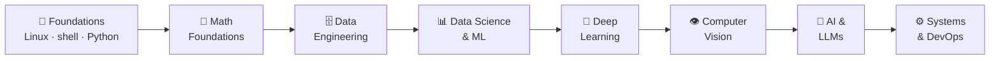
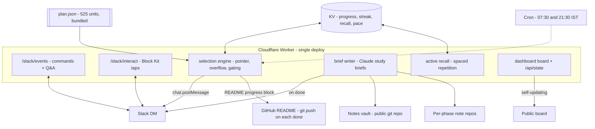
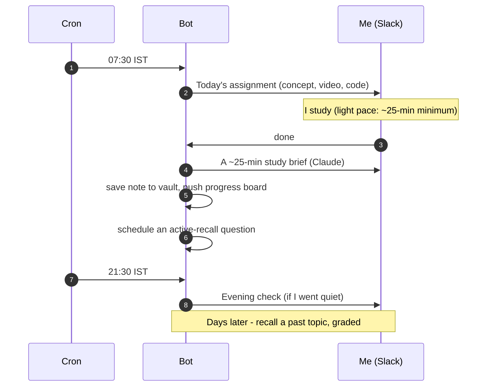
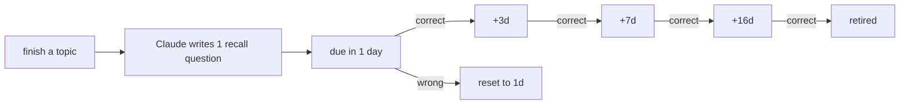

# 📘 Study Agent

> A personal AI study companion that runs a strict, basics-to-advanced Data → AI → DevOps mastery roadmap — assigning one focused thing a day, writing me a study brief when I finish, quizzing me on old topics via spaced repetition, and publishing my progress in public.

Built as a single **Cloudflare Worker + KV**, with a self-updating dashboard and a Slack DM bot. It holds a **75-week / 525-unit curriculum**, serves it day by day at a pace that flexes to my real life, and turns "I watched a tutorial once" into durable, examined understanding.

**It is the discipline I don't have to summon.** It decides what I study today, adapts when I fall behind (nothing is ever lost), teaches the topic, checks that I retained it days later, and keeps a public progress board so I'm accountable.

---

## 📈 Live progress

<!-- PROGRESS:START -->
`░░░░░░░░░░░░░░░░░░░░░░░░`

**0/525** days done · **0.0%**

▓ done · ▒ in progress (½ credit) · ░ to go

- **Current:** Week 1/75
- **Streak:** 0 days
- **Pending builds:** 75
- **Last completed:** —
- **Updated:** 2026-08-02 19:08 IST

75-week board (✅ done · 🟨 partial · ⬜ pending · Mon→Sun)

`W01` ⬜⬜⬜⬜⬜⬜⬜
`W02` ⬜⬜⬜⬜⬜⬜⬜
`W03` ⬜⬜⬜⬜⬜⬜⬜
`W04` ⬜⬜⬜⬜⬜⬜⬜
`W05` ⬜⬜⬜⬜⬜⬜⬜
`W06` ⬜⬜⬜⬜⬜⬜⬜
`W07` ⬜⬜⬜⬜⬜⬜⬜
`W08` ⬜⬜⬜⬜⬜⬜⬜
`W09` ⬜⬜⬜⬜⬜⬜⬜
`W10` ⬜⬜⬜⬜⬜⬜⬜
`W11` ⬜⬜⬜⬜⬜⬜⬜
`W12` ⬜⬜⬜⬜⬜⬜⬜
`W13` ⬜⬜⬜⬜⬜⬜⬜
`W14` ⬜⬜⬜⬜⬜⬜⬜
`W15` ⬜⬜⬜⬜⬜⬜⬜
`W16` ⬜⬜⬜⬜⬜⬜⬜
`W17` ⬜⬜⬜⬜⬜⬜⬜
`W18` ⬜⬜⬜⬜⬜⬜⬜
`W19` ⬜⬜⬜⬜⬜⬜⬜
`W20` ⬜⬜⬜⬜⬜⬜⬜
`W21` ⬜⬜⬜⬜⬜⬜⬜
`W22` ⬜⬜⬜⬜⬜⬜⬜
`W23` ⬜⬜⬜⬜⬜⬜⬜
`W24` ⬜⬜⬜⬜⬜⬜⬜
`W25` ⬜⬜⬜⬜⬜⬜⬜
`W26` ⬜⬜⬜⬜⬜⬜⬜
`W27` ⬜⬜⬜⬜⬜⬜⬜
`W28` ⬜⬜⬜⬜⬜⬜⬜
`W29` ⬜⬜⬜⬜⬜⬜⬜
`W30` ⬜⬜⬜⬜⬜⬜⬜
`W31` ⬜⬜⬜⬜⬜⬜⬜
`W32` ⬜⬜⬜⬜⬜⬜⬜
`W33` ⬜⬜⬜⬜⬜⬜⬜
`W34` ⬜⬜⬜⬜⬜⬜⬜
`W35` ⬜⬜⬜⬜⬜⬜⬜
`W36` ⬜⬜⬜⬜⬜⬜⬜
`W37` ⬜⬜⬜⬜⬜⬜⬜
`W38` ⬜⬜⬜⬜⬜⬜⬜
`W39` ⬜⬜⬜⬜⬜⬜⬜
`W40` ⬜⬜⬜⬜⬜⬜⬜
`W41` ⬜⬜⬜⬜⬜⬜⬜
`W42` ⬜⬜⬜⬜⬜⬜⬜
`W43` ⬜⬜⬜⬜⬜⬜⬜
`W44` ⬜⬜⬜⬜⬜⬜⬜
`W45` ⬜⬜⬜⬜⬜⬜⬜
`W46` ⬜⬜⬜⬜⬜⬜⬜
`W47` ⬜⬜⬜⬜⬜⬜⬜
`W48` ⬜⬜⬜⬜⬜⬜⬜
`W49` ⬜⬜⬜⬜⬜⬜⬜
`W50` ⬜⬜⬜⬜⬜⬜⬜
`W51` ⬜⬜⬜⬜⬜⬜⬜
`W52` ⬜⬜⬜⬜⬜⬜⬜
`W53` ⬜⬜⬜⬜⬜⬜⬜
`W54` ⬜⬜⬜⬜⬜⬜⬜
`W55` ⬜⬜⬜⬜⬜⬜⬜
`W56` ⬜⬜⬜⬜⬜⬜⬜
`W57` ⬜⬜⬜⬜⬜⬜⬜
`W58` ⬜⬜⬜⬜⬜⬜⬜
`W59` ⬜⬜⬜⬜⬜⬜⬜
`W60` ⬜⬜⬜⬜⬜⬜⬜
`W61` ⬜⬜⬜⬜⬜⬜⬜
`W62` ⬜⬜⬜⬜⬜⬜⬜
`W63` ⬜⬜⬜⬜⬜⬜⬜
`W64` ⬜⬜⬜⬜⬜⬜⬜
`W65` ⬜⬜⬜⬜⬜⬜⬜
`W66` ⬜⬜⬜⬜⬜⬜⬜
`W67` ⬜⬜⬜⬜⬜⬜⬜
`W68` ⬜⬜⬜⬜⬜⬜⬜
`W69` ⬜⬜⬜⬜⬜⬜⬜
`W70` ⬜⬜⬜⬜⬜⬜⬜
`W71` ⬜⬜⬜⬜⬜⬜⬜
`W72` ⬜⬜⬜⬜⬜⬜⬜
`W73` ⬜⬜⬜⬜⬜⬜⬜
`W74` ⬜⬜⬜⬜⬜⬜⬜
`W75` ⬜⬜⬜⬜⬜⬜⬜

<!-- PROGRESS:END -->

---

## Table of contents

- [Why it exists](#why-it-exists)
- [How it helps me every day](#how-it-helps-me-every-day)
- [The curriculum](#the-curriculum)
- [Architecture](#architecture)
- [The daily loop](#the-daily-loop)
- [Scheduling model](#scheduling-model-no-dates-just-a-pointer)
- [Active recall](#active-recall-spaced-repetition)
- [Adaptive pacing](#adaptive-pacing)
- [Learning in public](#learning-in-public)
- [Commands](#commands)
- [The intelligence layer](#the-intelligence-layer)
- [State model](#state-model)
- [Tech stack](#tech-stack)
- [Setup](#setup)

---

## Why it exists

Self-directed learning fails in predictable ways: no clear order (jumping to the advanced thing before the basics), no daily forcing function, no check that anything stuck, and no accountability. A 500-topic roadmap in a Notion doc is where motivation goes to die.

This agent fixes each failure mode structurally:

- **Order** → a single strict hierarchy, basics → advanced, that unlocks in sequence.
- **Forcing function** → one assignment lands every morning; an evening check nudges if I went quiet.
- **Retention** → spaced-repetition recall questions resurface old topics and grade my answers.
- **Accountability** → every completion updates a public GitHub progress board.
- **Sustainability** → gentle pacing + a pointer that waits, so a bad week bends the plan instead of breaking it.

## How it helps me every day

| Moment | What the agent does |
|---|---|
| **07:30 every morning** | The day's assignment arrives in Slack — one focused topic with a concept, a video to watch, and a code task. |
| **While I learn** | A gentle "minimum for today (~25 min)" keeps the bar reachable; heavy builds are spread one block at a time. |
| **When I finish (`done`)** | Claude writes me a ~25-minute study brief on the topic, saves it to my notes vault, and pushes my progress live. |
| **Days later** | It quizzes me on a *past* topic and grades my answer — so I actually retain, not just consume. |
| **If I fall behind** | Missed topics cascade forward automatically; the pointer waits. Nothing is lost, no guilt. |
| **Anytime** | I ask any question in plain English and get a first-principles answer connected to where I am in the roadmap. |

## The curriculum

**8 phases, strictly ordered basics → advanced** (each phase builds on the last — e.g. Computer Vision comes *after* Deep Learning, not before):

```mermaid
flowchart LR
    A["🐧 Foundations<br/>Linux · shell · Python"] --> B["📐 Math<br/>Foundations"]
    B --> C["🗄️ Data<br/>Engineering"]
    C --> D["📊 Data Science<br/>& ML"]
    D --> E["🧠 Deep<br/>Learning"]
    E --> F["👁️ Computer<br/>Vision"]
    F --> G["🤖 AI &<br/>LLMs"]
    G --> H["⚙️ Systems<br/>& DevOps"]
```

Each week is broken into daily **units** typed as *theory* (weekday, ~25–60 min), *build* (weekend project, blocks A/B/C), and *consolidate* (review + a mastery check). Weekday theory unlocks the weekend build; each phase has its own public notes repository.

## Architecture

A single Cloudflare Worker is the whole bot — Slack webhook, scheduled morning/evening sends, the dashboard board, and a passwordless sign-in flow. The curriculum is bundled at build time; mutable progress lives in KV.

```mermaid
flowchart TD
    subgraph Worker["Cloudflare Worker - single deploy"]
      WH["/slack/events - commands + Q&A"]
      IN["/slack/interact - Block Kit taps"]
      SEL["selection engine - pointer, overflow, gating"]
      BRIEF["brief writer - Claude study briefs"]
      RECALL["active recall - spaced repetition"]
      BOARD["dashboard board + /api/state"]
    end

    PLAN[["plan.json - 525 units, bundled"]] --> SEL
    KV[("KV - progress, streak, recall, pace")] <--> SEL
    KV <--> RECALL

    CRON["Cron - 07:30 and 21:30 IST"] -.-> SEL
    SEL -->|chat.postMessage| SLACK["Slack DM"]
    WH <--> SLACK
    IN <--> SLACK

    BRIEF -->|on done| SLACK
    BRIEF --> VAULT["Notes vault - public git repo"]
    BRIEF --> REPOS["Per-phase note repos"]
    BOARD -->|self-updating| WEB["Public board"]
    SEL -->|README progress block| GH["GitHub README - git push on each done"]
```

## The daily loop

```mermaid
sequenceDiagram
    autonumber
    participant C as Cron
    participant B as Bot
    participant M as Me (Slack)

    C->>B: 07:30 IST
    B->>M: Today's assignment (concept, video, code)
    Note over M: I study (light pace: ~25-min minimum)
    M->>B: done
    B->>M: A ~25-min study brief (Claude)
    B->>B: save note to vault, push progress board
    B->>B: schedule an active-recall question
    C->>B: 21:30 IST
    B->>M: Evening check (if I went quiet)
    Note over B,M: Days later - recall a past topic, graded
```

## Scheduling model (no dates, just a pointer)

The plan advances by a **pointer**, not a calendar — so it can't fall "behind schedule," only wait for me:

- **Weekdays** serve the oldest pending *theory*; **Saturday** clears any missed weekday theory then the build; **Sunday** serves anything still owed before a consolidation.
- Missed a Friday topic? It **cascades** into Saturday; the build slides to Sunday. **Nothing is lost.**
- `partial` carries the leftover over; `pause` freezes everything; a rest day (`off`) keeps the streak safe.
- `status` shows how many topics I owe — a backlog count, never date-drift guilt.

## Active recall (spaced repetition)

Consuming a tutorial isn't learning; *retrieving* it later is. On every completion the agent generates one recall question about the topic and resurfaces it at widening intervals — **1 → 3 → 7 → 16 → 35 days**:

```mermaid
flowchart LR
    DONE["finish a topic"] --> GEN["Claude writes 1 recall question"]
    GEN --> Q1["due in 1 day"]
    Q1 -->|correct| Q3["+3d"] -->|correct| Q7["+7d"] -->|correct| Q16["+16d"] -->|correct| RET["retired"]
    Q1 -->|wrong| RESET["reset to 1d"]
```

I type `recall`, answer in my own words, and the model grades it (correct / partial / incorrect) and reschedules accordingly. Mornings nudge me when one is due; `status` shows what's in rotation.

## Adaptive pacing

Two paces, defaulting to **light** so the daily bar is always reachable:

- **`pace light`** (default) — a ~25-minute *minimum* on theory days (video + extra practice optional), and heavy builds/consolidations spread **one block per day** via `partial`. Sustainable beats heroic.
- **`pace normal`** — the full daily target when I have the time and momentum.

## Learning in public

- On each `done`, the agent rewrites a `<!-- PROGRESS -->` block in this README (bar + streak + phase board) and **git-pushes it** — the [Live progress](#-live-progress) section above stays current automatically.
- Study briefs are saved to a **public notes vault** and per-phase note repositories, auto-committed.
- A **self-updating web dashboard** shows progress, streaks, and per-day notes; a passwordless `login` link signs me in.

## Commands

Sent as plain words in the Slack DM (Slack intercepts a leading `/`, so commands are typed **without** it):

| Command | Does |
|---|---|
| `today` | The current assignment |
| `done` · `partial` · `skip` | Complete / part-do / skip today |
| `more` · `catchup` | Get ahead / clear backlog |
| `recall` | Active-recall question on a past topic |
| `pace light` \| `normal` | Smaller daily chunks vs full targets |
| `on` · `off` | Check in / log a rest day (streak-safe) |
| `login` | One-tap dashboard sign-in link |
| `status` | Progress, backlog, recall due |
| `summary` · `recap` | Re-send / rewrite a brief from my real work |
| `pause` · `resume` · `help` | Freeze / resume / command list |

Anything else is answered as a free-form question by the model, grounded in where I am in the roadmap.

## The intelligence layer

Claude is used where it genuinely teaches or checks — everything structural (selection, scheduling, streaks) is deterministic code:

| Job | What the model does |
|---|---|
| **Study brief** | Writes a ~25-min first-principles brief on the day's topic. |
| **Active recall** | Generates one retention question per topic and grades my answer. |
| **Recap rewrite** | Regrounds a day's note in my *actual* work (my notes or a repo URL). |
| **Free Q&A** | Answers any question, connected to my current topic. |

## State model

Progress lives in a single KV object — completions, partials, streak/presence, `recall` queue, `pace`, pause state, project links. The 525-unit plan is bundled read-only, so the bot is fully curriculum-agnostic (week/unit counts derive from the plan, nothing is hardcoded).

## Tech stack

**Cloudflare Workers** (edge) · **Workers KV** (state) · **Cron Triggers** (07:30 / 21:30 IST) · **Slack** (Events API + Web API + Block Kit) · **Claude** (briefs, recall, Q&A) · **GitHub API** (auto-committed notes + progress board) · vanilla JS, zero build step.

## Setup

> This repo runs my own bot against my own Slack + roadmap. High level to run your own:

1. `wrangler kv namespace create STUDY`; generate a `plan.json` curriculum.
2. Create a Slack app (Events API DM + interactivity); set `SLACK_BOT_TOKEN` + `SLACK_SIGNING_SECRET`.
3. Set `ANTHROPIC_API_KEY` and a `GH_PAT` for progress pushes.
4. `wrangler deploy` — the single Worker serves the bot, the board, and the morning/evening cron.

---

*Learning in public — the plan, the notes, and the progress are all out here on purpose.*
